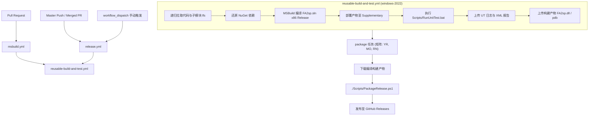
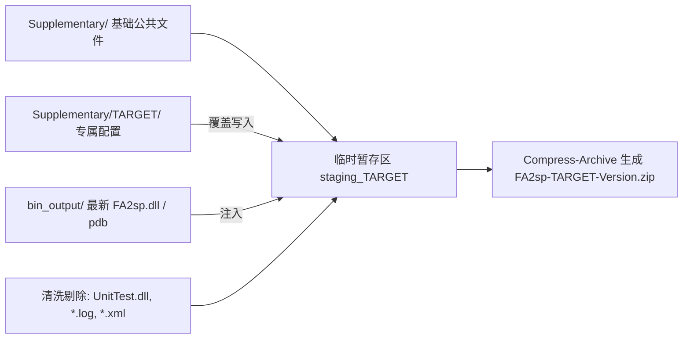

# INI 键值与小节顺序对齐实施方案与完成报告 (Alignment Plan & Architecture Report)

> **目标**：在 `FA2Copy`（分支 `enhance/rn-version-alignment`）中实现 INI 保存时保持原始小节顺序与小节内原始键值对顺序（支持自适应纯数/多段数字自然排序），实现与 [`YR_RN_Mission_Editor`](file:///D:/Developments/RevengeNow/Codes/YR_RN_Mission_Editor) 行为全面对齐；提供模块化配置项 `SaveMap.AdaptiveSorting` / `SaveMap.PreserveINISorting`，以 **CINIExt 动态函数指针零开销切换机制** 包办所有 INI 变更操作；并建立完整的单元测试体系 (UT)、持续集成流水线 (CI) 与多版本发包分拣脚本。

---

## 一、方案核心架构设计

### 1.1 零破坏解耦设计 (Decoupled Sidecar Design)
由于旧版 32 位 `FinalSun.exe` / `FinalAlert2YR.dat` 核心逻辑与 `CINI` / `INISection` 的二进制结构存在紧耦合（IDA 逆向已证实 `EntitiesDictionary` 与 `IndicesDictionary` 具有固定内存偏移），任何直接修改 `sizeof(INISection)` 或改变内部 `std::map` 类型的改动都会引发主程序崩溃。

因此采用**外置侧车追踪器 (`CINIOrderTracker`)**：
- 内部核心数据结构为 **`SequencedKeyList`**，采用 **$O(1)$ Multi-Index 双索引模型**：
  $$\text{SequencedKeyList} = \text{std::list<CString>} \;+\; \text{std::unordered\_map<CString, list::iterator>}$$
- **复杂度表现**：
  - **插入 (Add)**：$O(1)$，若已存在则忽略，不存在则尾插并记录迭代器。
  - **删除 (Remove)**：$O(1)$，通过哈希表直接定位链表迭代器擦除，避免 `std::vector` 的 $O(N)$ 元素搬移开销。
  - **查询/存在性检查 (Contains)**：$O(1)$。
  - **遍历 (Iteration)**：严格按照自然插入顺序顺序遍历。

### 1.2 自适应键排序 (Adaptive Sorting)
针对红警地图逻辑中具有严苛顺序要求的特殊 Section（例如脚本动作序号 `0, 1, 2...`、单位结构列表 `[Units]`, `[Structures]`、触发 `[TeamTypes]`）：
- **文本键（非数字）**：严格保持文件读取与创建时的插入自然队列顺序（FIFO 语义）。
- **纯数字 / 多段数字键**：在删除再新增时，采用 Westwood 格式自然数值排序器（`WestwoodNumericKeyCompare`），避免将重新添加的编号键挤压到 Section 末尾导致地图解析逻辑错乱。

### 1.3 CINIExt 代理与动态函数指针零开销切换机制 (Dynamic Function Pointer Dispatch)
为了杜绝在业务代码或单元测试中到处“手动补充调用 `RecordKey` / `RemoveKey`”的别扭耦合，同时避免在热点写入路径上产生不必要的分支判断：
1. **全局静态单例包装**：
   - 声明 `CINIExt` 继承自 `CINI`（`sizeof(CINIExt) == sizeof(CINI) == 80` 字节，零新增成员变量，确保直接重映射 `0x7ACC80` 时不会踩踏相邻结构 `CMapData::Size`）。
   - 提供 `CINIExt::CurrentDocument` 全局引用，并在注释中严格规范所有开发者统一使用该实例。
2. **函数指针动态切换**：
   - 内部静态函数指针：`FnRecordKey`、`FnRemoveKey`、`FnRecordSection`、`FnRemoveSection`。
   - 当 `AdaptiveSorting` / `PreserveINISorting` 启用时：函数指针指向真实的 `CINIOrderTracker::RecordKey` / `RecordSection`。
   - 当未启用时：函数指针在 `SetAdaptiveSorting(false)` 时直接切换为内部 `static void NoOp(...) noexcept {}` 空函数。
   - **极致性能**：关闭功能时无任何分支条件判断 (`if`)，直接调用空函数内联或直接返回，开销趋近于 0。

---

## 二、单元测试 (UT) 架构与用例矩阵

### 2.1 In-Process 进程内测试架构
传统单元测试难以覆盖与 `FinalAlert2YR.dat` 二进制宿主高度绑定的 INI 内存与钩子逻辑。为此设计并实现了进程内挂钩测试架构：
- **测试工程**：位于 `FA2sp.UnitTest/`，编译生成 32 位动态链接库 `Supplementary/FA2sp.UnitTest.dll`。
- **Syringe 动态挂钩**：
  - 测试 DLL 利用 Syringe 挂钩宿主程序入口 `CFinalSunApp::InitInstance`（地址 `0x41FAD0`）。
  - 入口劫持：在宿主创建任何 MFC GUI 窗口之前接管控制权。
- **输出重定向与干净退出**：
  - 将 stdout / stderr 重定向到 `Supplementary/UnitTest.log`，并通过 GoogleTest 导出 `Supplementary/UnitTest.xml`。
  - 将命令行参数转发给 `testing::InitGoogleTest(&argc, argv)`，执行 `RUN_ALL_TESTS()`。
  - 测试执行完毕后刷新缓冲区并直接调用 `ExitProcess(res)` 退出，杜绝弹出主界面阻塞 CI 无人值守环境。

### 2.2 运行隔离机制 (Strict Isolation Mechanism)
- 运行测试时，宿主目录下如果同时存在生产 DLL `FA2sp.dll`，会导致 Hook 符号与 Syringe 注入表发生冲突。
- 启动脚本 [`Scripts/RunUnitTest.bat`](file:///D:/Developments/RevengeNow/Codes/FA2Copy/Scripts/RunUnitTest.bat) 实现了自动化隔离：
  1. 检查并将 `FA2sp.dll` 临时重命名为 `FA2sp.dll.isolated`；
  2. 调用 `Syringe.exe FinalAlert2YR.dat` 注入 `FA2sp.UnitTest.dll` 执行测试；
  3. 捕获退出码；
  4. 无论测试成功还是异常退出，均在 `finally` 阶段无条件还原 `FA2sp.dll`；
  5. 返回真实退出码，确保自动化流程捕获断言失败。

### 2.3 单元测试覆盖矩阵 (21 Tests)
在 [`FA2sp.UnitTest/CINIOrderTrackerTest.cpp`](file:///D:/Developments/RevengeNow/Codes/FA2Copy/FA2sp.UnitTest/CINIOrderTrackerTest.cpp) 中构建了 21 个自动化测试用例，覆盖所有排列组合与边界情况：

| 测试套件 | 测试用例名称 | 核心验证内容 |
| :--- | :--- | :--- |
| **SequencedKeyListTest** | `PreservesInsertionOrder` | 验证多键按插入顺序依次存储与输出 |
| | `IgnoresDuplicateAdditions` | 重复插入相同键时忽略，不改变原有链表位置 |
| | `ReAddAfterRemovePushedToTailQueueSemantics` | 模拟 FIFO 队列语义：删除后再插入排至队尾 |
| | `RemoveHeadAndTail` | 链表头节点与尾节点删除的边界处理 |
| | `ClearResetsState` | 清空链表与哈希表，状态完全重置 |
| **CINIOrderTrackerTest** | `SectionOrderTrackingAndQueueSemantics` | Section 维度的插入保序与删除再加尾部追加语义 |
| | `KeyOrderTrackingAndQueueSemantics` | Section 内部 Key 维度的插入保序与顺序追踪 |
| | `RealCINICrudKeyOperations` | 结合真实 `CINIExt` 的 `WriteString` / `DeleteKey` 透明追踪 |
| | `RealCINICrudSectionOperations` | 结合真实 `CINIExt` 的 `AddSection` / `DeleteSection` 透明追踪 |
| | `RealCINIAutoTrackingUntrackedItems` | 未显式通过 `RecordKey` 录入的新键在遍历时自动捕获 |
| | `RealCINIDeletedItemsOmittedDuringIterationEvenWithoutUntrack` | 被 CINI 删除的键即使 Tracker 未同步也会在迭代时自动剔除 |
| | `RealCINIPreserveOrderTrueVsNaturalMapOrder` | 对比测试：开启保序输出 vs 未开启时 `std::map` 字母序输出 |
| | `RealCINIComplexMapLifecycleSimulation` | 模拟复杂地图加载、增删修改、保存重构全生命周期 |
| | `RealCINISameKeyDeletedAndReaddedHeadMiddleTailCombinations` | 单 Section 内头、中、尾不同位置 Key 删除再添加组合 |
| | `RealCINISameSectionDeletedAndReaddedHeadMiddleTailCombinations` | 多个 Section 头、中、尾不同位置删除再添加组合 |
| | `RealCINIInterleavedKeyAndSectionDeleteReaddStressTest` | 节与键高频交替增删的极端压力场景 |
| | `AdaptiveSortingNumericKeysPreserveNaturalOrderOnDeleteAndReadd` | **核心自适应排序**：删除中间数字键（如 1）再添加时，自动维持 `0, 1, 2, 3` 自然数字升序而非排到末尾 |
| | `AdaptiveSortingWestwoodNumericComparatorMultiDigit` | **Westwood 自然数值比较**：验证多位数升序排序（如 `0..9, 10, 11` 正确排在 9 之后，而非按 ASCII 字符排在 1 之后） |
| | `AdaptiveSortingMixedSectionPreservesTextHeaderAndOrdersNumericArray` | **混合小节测试**：头部元数据文本项维持原序，尾部数字动作阵列自适应升序 |
| | `AdaptiveSortingUntrackedKeyWithoutManualRecordKeyAutoSorted` | 真实地图加载场景下，直接载入未追踪文本段同样按规则正确排布 |
| | `DynamicFunctionPointerSwitchingAdaptiveSortingToggle` | **动态函数指针切换验证**：关闭自适应排序时指向 `NoOp`（零开销无记录），开启后实时挂接追踪 |

---

## 三、持续集成 (CI) 工作流改动

CI 架构重构为基于 GitHub Actions 的模块化、多触发点流水线体系：

### 3.1 可复用构建与测试工作流 ([`reusable-build-and-test.yml`](file:///D:/Developments/RevengeNow/Codes/FA2Copy/.github/workflows/reusable-build-and-test.yml))
- **运行环境**：`windows-2022` 虚拟机。
- **子模块与大文件处理**：配置 `submodules: recursive` 与 `lfs: true`，确保 `FA2pp`、`MFC42`、`googletest`、`lexilla`、`scintilla` 完整克隆。
- **依赖还原与并发编译**：
  - 自动通过 `nuget restore FA2sp.sln` 还原项目第三方依赖（如 `lua`、`openssl`）。
  - 执行 `msbuild /m /p:Configuration=Release /p:Platform=x86 FA2sp.sln`，一次性并发编译主工程与 UT 工程。
- **自动化测试执行与日志保全**：
  - 无缝调用 `Scripts\RunUnitTest.bat` 运行测试套件。
  - 采用 `if: always()` 策略，无论测试成功还是失败，均完整收集并上传 `UnitTest.log`、`UnitTest.xml` 及 `syringe.log`（保留 7 天），便于远端复现和排查断言错误。

### 3.2 PR 校验流水线 ([`msbuild.yml`](file:///D:/Developments/RevengeNow/Codes/FA2Copy/.github/workflows/msbuild.yml))
- 监听所有分支的 PR 创建与更新（过滤图片和文档变动），调用 `reusable-build-and-test.yml` 进行严格的零警告、全绿测试卡点验证，防止任何破坏性改动合并入主干。

### 3.3 自动发版流水线 ([`release.yml`](file:///D:/Developments/RevengeNow/Codes/FA2Copy/.github/workflows/release.yml))
- 监听 `master` 分支的 PR 合并或手动调度。
- 自动计算流水号版本（如 `v1.6.x`）或接受自定义 Tag。
- 启动 `matrix: [YR, MO, RN]` 矩阵任务，并行调用发包脚本分发三种针对性架构的 ZIP 包。

---

## 四、Release 脚本分拣与打包思路

打包脚本 [`Scripts/PackageRelease.ps1`](file:///D:/Developments/RevengeNow/Codes/FA2Copy/Scripts/PackageRelease.ps1) 承担了本地发布模拟与 CI 矩阵打包的核心职能。其设计理念为：**分层覆盖 (Layered Overlay) + 白名单/黑名单清洗 (Sanitization)**。

### 4.1 分层覆盖分拣流程
每个发行版（Edition）的打包流水线严格遵循以下阶段：

1. **第一层：基底拷贝 (Base Tree)**
   - 将 `Supplementary/` 下的所有通用编辑器运行资源（`FinalAlert2YR.dat`、核心 CSF 语言包、公共图块、Syringe 运行库等）全量克隆到暂存区 `staging_$t`。
2. **第二层：版本差异化分拣与覆盖 (Edition Customization)**
   - **`YR` (原版尤里复仇)**：
     - 直接删除暂存区中的 `MentalOmega/` 与 `RevengeNow/` 目录。
     - 保留默认的 `FAData.ini` 及原生 YR 触发/小队/动作配置。
   - **`MO` (心灵终结 Mental Omega)**：
     - 递归读取 `staging/MentalOmega/` 下的文件，逐项覆盖到暂存区根目录（如 MO 专属 `FAData.ini`、CSF 与定制库）。
     - 删除多余的 `MentalOmega/` 与 `RevengeNow/` 子目录。
   - **`RN` (复仇时刻 Revenge Now)**：
     - 递归读取 `staging/RevengeNow/` 下的文件，逐项覆盖到暂存区根目录。
     - 注入 RN 专属配置：
       - `SaveMap.PreserveINISorting=true`（保持小节物理出现顺序）；
       - `SaveMap.AdaptiveSorting=true`（自适应数字键递增排序与文本键保序）；
       - `SaveMap.KeepComments=false`（不保留注释）；
       - `UTF8Support.AlwaysSaveAsUTF8=true`（**总是以 UTF-8 编码保存地图**）；
       - 157 项定制 Ares 动作与完整 RN 阵营定义。
     - 删除多余的 `MentalOmega/` 与 `RevengeNow/` 子目录。
3. **第三层：编译二进制注入 (Binary Injection)**
   - 自动探测 `bin_output/` 或 `Release/` 目录，将最新编译的 `FA2sp.dll` 与符号文件 `FA2sp.pdb` 复制到暂存区。
4. **第四层：研发与测试产物深度清洗 (Sanitization)**
   - 严格剔除开发/CI 产生的中间文件，防止污染用户包：
     - 删除 `FA2sp.UnitTest.dll`；
     - 删除 `RunUnitTest.bat`；
     - 删除所有日志 `*.log`、报告 `*.xml`；
     - 删除隔离标记文件 `*.isolated`。
5. **第五层：归档与统计**
   - 使用 PowerShell 原生 `Compress-Archive` 输出标准发布包：`FA2sp-{Target}-{Version}.zip`。
   - 打印生成的归档大小并清理暂存工作区。

---

## 五、开发者规范与注意事项

1. **全局地图对象操作守则**：
   - 在 `FA2sp` 所有模块与对话框窗口中，**必须始终操作 `CINIExt::CurrentDocument`**，严禁直接使用底层 `CINI::CurrentDocument`。
   - 直接访问 `CINI::CurrentDocument` 会绕过 `CINIExt` 的虚函数与成员拦截（`WriteString`、`DeleteKey`、`AddSection` 等），导致 `CINIOrderTracker` 追踪断裂。
2. **子模块保护红线**：
   - `FA2pp/` 为第三方子模块，**绝对不得做任何就地修改或提交**。
3. **提交与推送规范**：
   - 所有变更必须在本地完成 `FA2sp.sln` 编译通过（0 警告、0 错误）与 `Scripts\RunUnitTest.bat` 21 项测试全绿通过后方可提交。
   - 未经用户显式授权，**严禁执行 `git push`**。
